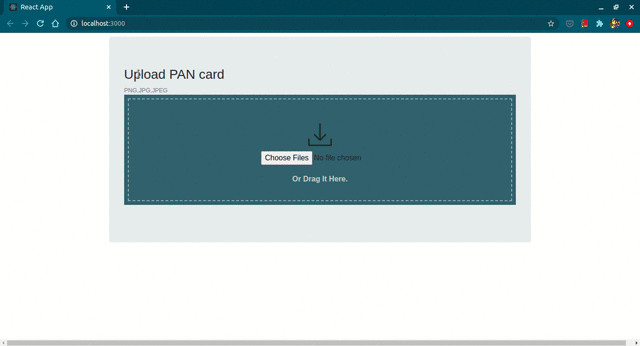
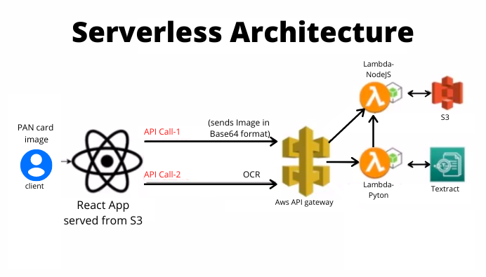

# Info-Extractor-OCR

Info-Extractor-OCR is a real-time Serverless OCR web app that would help extract PAN card details such as the Name, Permanent Account Number(PAN), and the Date of Birth. Images(.jpg,.jpeg,.png) can be processed and they can then be downloaded as structured data in CSV-format.



**Technologies used:**
* **AWS services:** API-Gateways, LambdaFunctions, Textract, S3
* **React.JS:** Client-side
* **Python:** Backend
* **NodeJS:** Backend

## Project Architecture
</img>

**1. React:**
* React (also known as React.js or ReactJS) is an open-source, front end, JavaScript library for building user interfaces or UI components.
* This is going to be the client-side of the project which would be interacting with all the AWS functionalities via RESTful API calls.
* Two API calls are gonna be made. The first one would POST the image data in Base-64. The second one would be to invoke the OCR functionalities.

**2. AWS API-gateway:**
* Amazon API Gateway is a fully managed service that makes it easy for developers to create, publish, maintain, monitor, and secure APIs at any scale.
* APIs act as the "front door" for applications to access data, business logic, or functionality from your backend services. 
* Using API Gateway, you can create RESTful APIs that enable real-time two-way communication applications. 
* In this project, based on the requests made the API-gateway is going to invoke the respective AWS micro-service via the Lambda-functions.

**3. AWS Lambda-Functions:**
* AWS Lambda lets you run code without provisioning or managing servers.
* As data flows through services, you use Lambdas to run custom code on that data stream.

**4. S3:**
* An Amazon S3 bucket is a public cloud storage resource available in Amazon Web Services' (AWS) Simple Storage Service (S3), an object storage offering. 
* Amazon S3 buckets, which are similar to file folders, store objects, which consist of data and its descriptive metadata.
* This service is going to be responsible for hosting this website and for temporary storage for the PAN images that would be processed by Textract.

**4. Python and Textract:**
* Textract is going to work in conjunction to help extract the data from the images
* RegEx is used for extracting specific fields such as Name, PAN, Date of Birth.
* The response is then sent back to the client


## Installation

You would need the following:

1. <a href="https://docs.npmjs.com/downloading-and-installing-node-js-and-npm" style="text-align:center">npm</a>
2. React:
```
npx create-react-app my-app
cd my-app
npm start
```
3. AWS account
4. AWS website hosting commands:
```
npm run-script build  
cd build
aws s3 sync . s3://BUCKET_NAME
```

## Usage
You could check the hosted website <a href="http://react-info-extractor-web-app.s3-website.ap-south-1.amazonaws.com/">here</a>.
Also please do note that you would have to download and enable ```Allow CORS``` Chrome extension(if your browser blocks CORS by default) or else it wouldn't work. 
<a href="https://chrome.google.com/webstore/detail/allow-cors-access-control/lhobafahddgcelffkeicbaginigeejlf?hl=en">Allow CORS: Chrome Extension</a>

## Contributing
Pull requests are welcome. For major changes, please open an issue first to discuss what you would like to change.

Please make sure to update tests as appropriate.

## License
[MIT](https://choosealicense.com/licenses/mit/)
